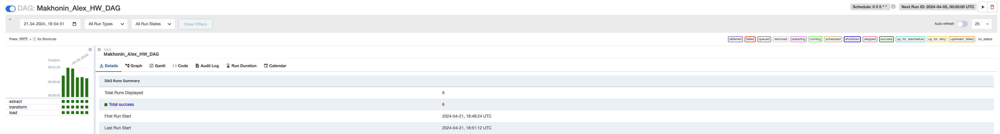

# sf_data_engineering

## How to run

* Download data:

  ```bash
  curl -sLo files_hw_DE.zip https://lms.skillfactory.ru/asset-v1:SkillFactory+MFTIDS+SEP2023+type@asset+block@files_hw_DE.zip
  unzip files_hw_DE.zip files_hw_DE/profit_table.csv
  mv files_hw_DE/profit_table.csv shared_folder/
  ```

* Install dependencies:

  ```bash
  poetry install
  ```

* Setup airflow:

  ```bash
  export AIRFLOW__CORE__DAGS_FOLDER="$(pwd)/dags/"
  export AIRFLOW_HOME="$(pwd)/airflow_data"
  poetry run airflow db migrate
  poetry run airflow users create --username airflow --firstname Airflow --lastname Airflow --email airflow@airflow.com --role Admin --password airflow
  poetry run airflow webserver --port 8888 --daemon
  poetry run airflow scheduler --daemon
  ```

* Enable dags:

  ```bash
  poetry run airflow dags unpause Makhonin_Alex_HW_DAG_Bonus
  poetry run airflow dags unpause Makhonin_Alex_HW_DAG
  ```

## Results basic

### Dag code: [dags/hw_dag.py](dags/hw_dag.py)





## Results bonus

### Dag code: [dags/hw_dag_bonus.py](dags/hw_dag_bonus.py)


